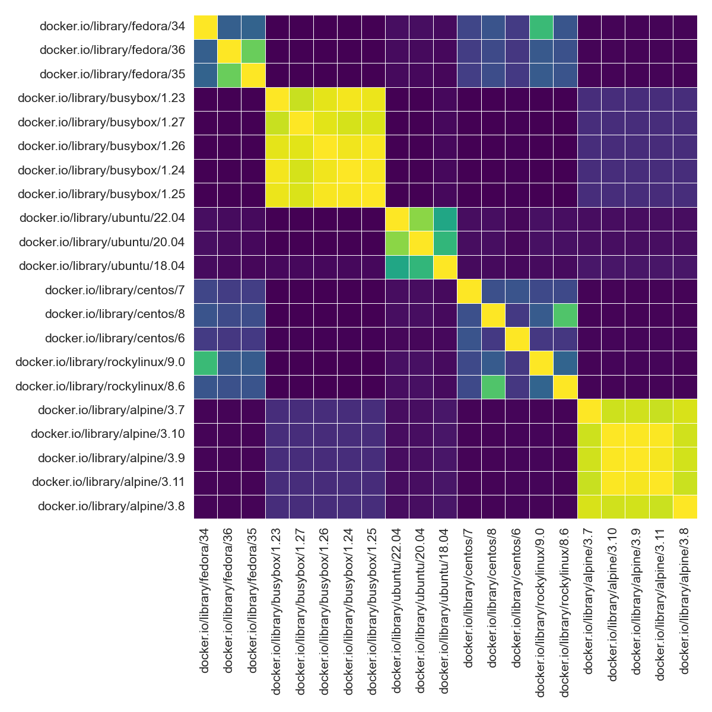

# Container Guts!

Want to know the "guts" inside your container, or more specifically,
the executables on the PATH inside, and filesystem paths? 🤓

This is a library and set of GitHub actions to derive that!

## Usage

For client and GitHub Actions usage, see our ⭐️ [documentation](https://singularityhub.github.io/guts/) ⭐️
There are (or will be) scattered examples under [examples](examples), e.g.,

## TODO

- support for singularity and podman (if requested)
