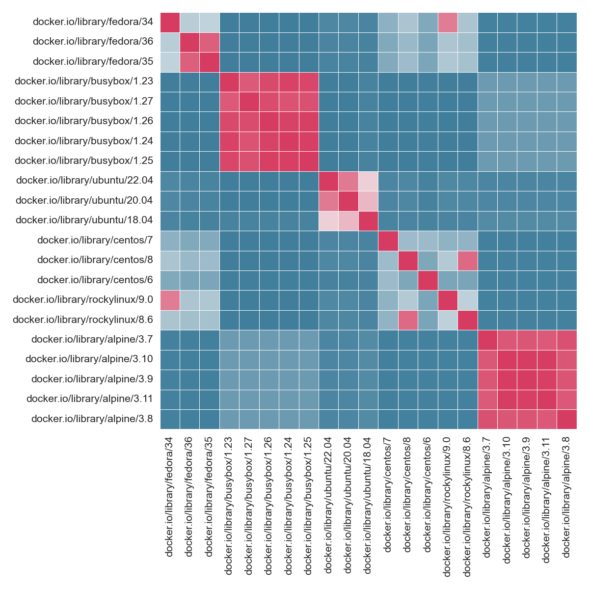

# OS Diffs

This is a little example analysis to use the diffs from [singularityhub/shpc-guts](singularityhub/shpc-guts)
to find differences in filesystem paths. The goal of this (for me) is to find patterns that distinguish
different bases.

```bash
$ git clone https://github.com/singularityhub/shpc-guts /tmp/shpc-guts
$ python diff.py /tmp/shpc-gutss
```

The output will generate:

 - png/svg of a heatmap that compares base OSs (below)
 - a [unique-paths.json](unique-paths.json) to show paths unique to each base image
 - a [os-diffs.csv](os-diffs.csv) with the raw data.



## What I Learned

 - busybox only has content in bin, and no PATH variables
